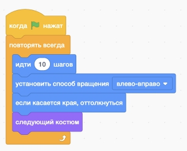

# Программирование для детей
## Бесконечное движение
|Описание|Задание|Код|Действие|
|---|---|---|---|
|Бесконечное движение|1. Замедлить движение персонажа в 3 раза.  2. Ускорить движение персонажа в 2 раза   3. Выполнить действие 50 раз.  4. Подберите такое количество повторений, чтобы персонаж проходил "полный круг" и останавливался в том же месте.| ||
## Добавление фона
Для добавления нового фона необходимо нажать кнопку "Выбрать фон"  
  
И выбрать один из нужных фонов  
  
В результате - выбрать 3 нужных фона  
    
|Описание|Задание|Код|Действие|
|---|---|---|---|
|Изменение фона (при бесконечном движении)|1. Выбрать фоны Castle 1, Castle 2, Castle 3.   2. Выбрать фоны Bedroom 1, Bedroom 2, Bedroom 3,    3. Выбрать фоны Beach malibu, Beach Rio, Desert.  4. Выбрать фоны Soccer 1, Soccer 2, Soccer 3 5. По какому принципу объеденины задания 1-4|   ||

## Исходные материалы
[Материалы для первых 4-х уроков](https://docs.google.com/spreadsheets/d/1LON9tPct4kkFUuNFz05PA_l4KDYCg_vyDKU0zNL8cno/edit#gid=0)